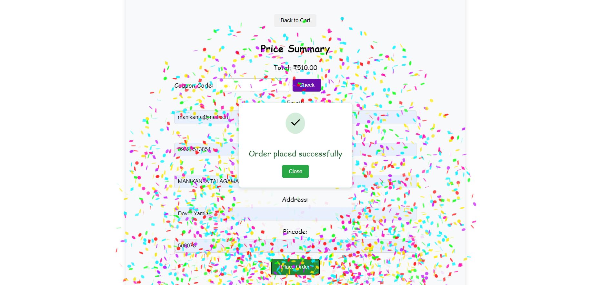
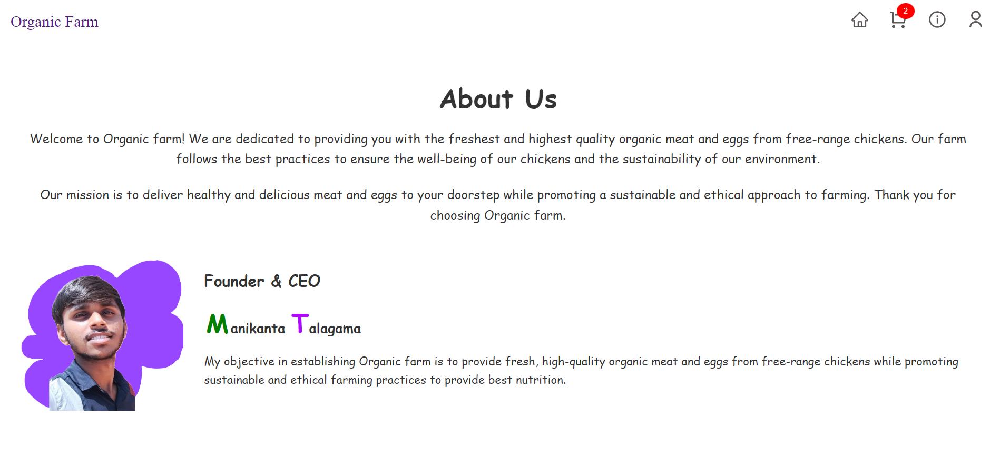
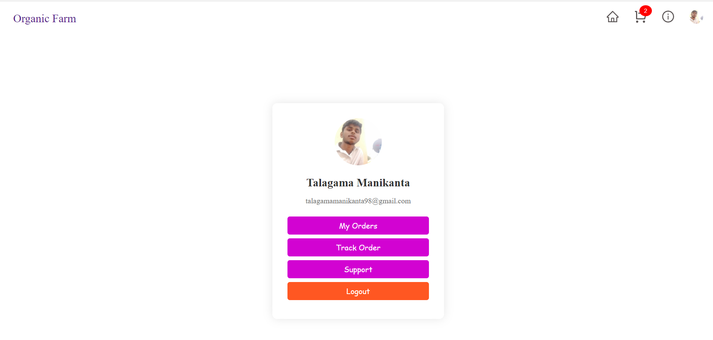

**Organic farm products Ordering Web App**

**View it by clicking:** https://organic-egg-farm.vercel.app/

**Description:**
Organic farm products Ordering Web App is a React-based application that allows users to order organic eggs online. The app features a home page with product details, a cart for managing orders, and a checkout process. The app also includes user authentication with Google and a profile page.

  
  
  
   
  
  
  
 

**Features**

- User authentication with Google
- Home page with a card layout for products
- Add to cart functionality
- Cart page with product summary and total price
- Order success notification with confetti animation

**Tech Stack**

- Frontend: React, React Router, CSS
- Database: Firebase Firestore
- Authentication: Firebase Authentication (Google)
- Hosting: Vercel
